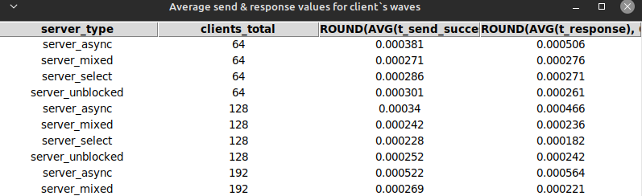
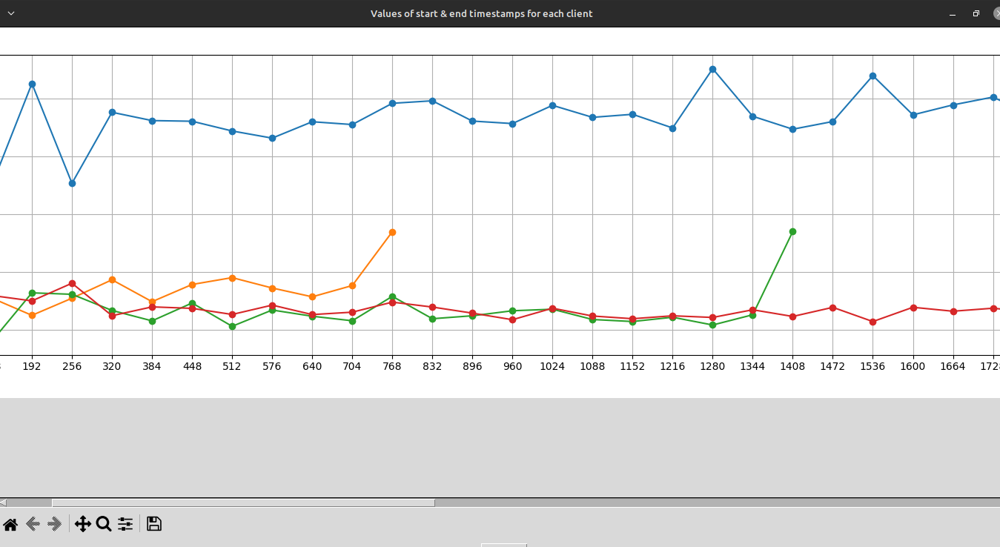
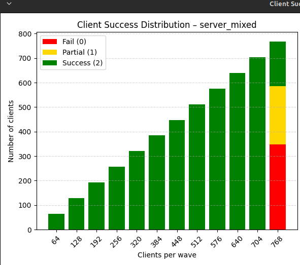

# Server-Client Benchmarking and Visualization Suite

This project provides tools for running server-client performance tests, collecting statistical data into SQLite, and visualizing results interactively via Tkinter and Matplotlib.

---
Table view, multi-line graph, and stacked diagram examples:





---
## Overview

The suite includes:

- Automated testing of server and clients with different communication modes.
- Storage and retrieval of test statistics using SQL queries.
- Interactive interfaces to view raw data tables and graphical plots.
- Support for various aggregation metrics (average, median, percentiles).

---

## Modules

### main_visual_interface.py

Main interactive console interface.
Allows running test suites, selecting SQL query templates, viewing results as tables, and generating graphical plots.

### graph_matplotlib_tkinter.py

Functions to make tables and plot graphs using Matplotlib embedded in Tkinter windows.

Table creation occurs in separate threads, while graphs are generated in separate processes, allowing multiple such windows to be displayed on screen simultaneously.
Includes scrollbars for navigating wide data ranges and interactive toolbar for zooming and saving.

### db_utils.py

Database helper functions for executing SQL queries and fetching results from SQLite.

### query_loader.py

Manages SQL query templates stored in a JSON file.
Supports listing, loading, and editing templates interactively.

### server_client_maker.py

Contains logic for launching and controlling server and client processes used in benchmarks. You can run this module directly, bypassing the main interface, if you only need to populate the database with test results.

---

## Usage

1. Run the main interface by executing `main_visual_interface.py`.

2. Choose from the menu options to:
   - Run server-client test suite to collect new data.
   - Display data tables from SQL queries.
   - Plot graphs based on aggregated metrics (average, median, percentiles).

3. Customize SQL queries by editing JSON templates to tailor data views.

### How It Works

Before any visualization can be performed, the database must be populated with test results. This is achieved by launching waves of client connections for the selected server type.

Each client, upon establishing a connection, performs two consecutive *"send message – receive response"* operations. Every intermediate stage of these actions, along with any potential errors, is logged with timestamps or measured durations of successful events.

The test begins with 64 clients launched simultaneously (in separate threads). Each subsequent wave adds 64 more clients, up to a maximum of 4096, or until a fatal server error occurs. In the event of such an error, remaining clients in the current wave attempt to complete their work and log results, after which the test terminates.

Before each test run, you will be prompted to either **drop and recreate** the entire log database or **append** results to the existing one.

Once the log database is available, you can display the results of raw and post-processed SQL queries as tables, graphs, and charts. It is also possible to create new SQL queries and edit existing ones using a built-in console editor.

> ⚠️ **Note**: There is no validation of the SQL queries you write. Errors will only become apparent when you try to use a faulty query.

---

## Requirements

#### Python 3.12+ (if you remove modern type annotations from the code, then 3.9+)

- Required Python packages (install via Poetry, uv or pip):
  - matplotlib
  - numpy

---

## Installation

#### Clone this repository:
   ```bash
   git clone https://github.com/K-N-A-R-G/Server_tester.git
```
---

## Development Notes

- Tables are loaded incrementally in batches to keep UI responsive.
- Graphs support horizontal scrolling to accommodate large X-axis ranges.
- Aggregation modes can be extended by modifying plotting functions.
---
## Contributing

This is a personal project and not currently accepting external contributions.
